# 前言

想要弄清楚一件事情或者一个东西到底是什么无外乎是三个问题

* what？什么东西？
* why？为什么这东西能做到？
* how？这东西要如何去使用？

所以本文以上面三个问题来展开陈述

# what？

## 定义

我们知道，软件依赖的环境大致包括：

* 操作系统
* 配置文件
* 代码
* 开发工具包
* 软件服务器

Docker作为一个软件集装箱化平台，可以让开发者构建应用程序时，将它与其依赖环境一起打包到一个容器中，然后很容易地发布和应用到任意平台中。

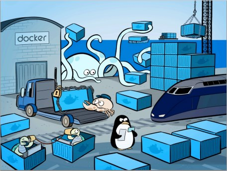

## 思想

* Isolation (隔离)
* Standardized (标准化)
* Container (集装箱)

引用官网一句话

__Package Software into Standardized Units for Development, Shipment and Deployment__
译文：将软件打包成标准化的单元，用于开发、交付和部署

__引用知乎大佬高赞总结__
作者：刘允鹏
链接：https://www.zhihu.com/question/28300645/answer/67707287
来源：知乎
 > Docker的思想来自于集装箱，集装箱解决了什么问题？在一艘大船上，可以把货物规整的摆放起来。并且各种各样的货物被集装箱标准化了，集装箱和集装箱之间不会互相影响。那么我就不需要专门运送水果的船和专门运送化学品的船了。只要这些货物在集装箱里封装的好好的，那我就可以用一艘大船把他们都运走。docker就是类似的理念。现在都流行云计算了，云计算就好比大货轮。docker就是集装箱。
 
 > 1.不同的应用程序可能会有不同的应用环境，比如.net开发的网站和php开发的网站依赖的软件就不一样，如果把他们依赖的软件都安装在一个服务器上就要调试很久，而且很麻烦，还会造成一些冲突。比如IIS和Apache访问端口冲突。这个时候你就要隔离.net开发的网站和php开发的网站。常规来讲，我们可以在服务器上创建不同的虚拟机在不同的虚拟机上放置不同的应用，但是虚拟机开销比较高。docker可以实现虚拟机隔离应用环境的功能，并且开销比虚拟机小，小就意味着省钱了。
 
 > 2.你开发软件的时候用的是Ubuntu，但是运维管理的都是centos，运维在把你的软件从开发环境转移到生产环境的时候就会遇到一些Ubuntu转centos的问题，比如：有个特殊版本的数据库，只有Ubuntu支持，centos不支持，在转移的过程当中运维就得想办法解决这样的问题。这时候要是有docker你就可以把开发环境直接封装转移给运维，运维直接部署你给他的docker就可以了。而且部署速度快。
 
 > 3.在服务器负载方面，如果你单独开一个虚拟机，那么虚拟机会占用空闲内存的，docker部署的话，这些内存就会利用起来。


## 核心

docker有3大核心：镜像、容器、仓库。

鲸鱼是操作系统。
要交付的应用程序是各种货物，要将各种形状和尺寸不同的货物放到大鲸鱼上，得考虑每件货物怎么安放（应用程序配套的环境），还得考虑货物和货物之间能否重叠起来（应用程序依赖的环境是否会冲突）。
现在使用了集装箱（容器）把每件货物都放到集装箱里，这样大鲸鱼可以用同样地方式安放、堆叠集装了，省事省力。
即：打包放到鲸鱼上，鲸鱼放到服务器上。也就是“build——ship——run”，这样在自己的电脑上怎么运行，在服务器上也会怎么运行。
用

__去仓库把镜像拉到本地，然后用一条命令把镜像运行起来，变成容器。__

### 镜像-复制的程序(Image)
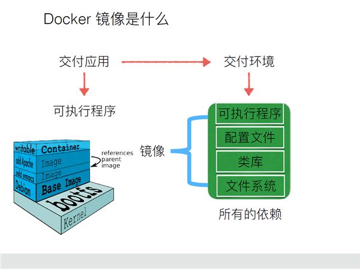

* 定义：
类似于虚拟机中的镜像，是一个包含有文件系统的面向Docker引擎的只读模板。任何应用程序运行都需要环境，而镜像就是用来提供这种运行环境的。例如一个Ubuntu镜像就是一个包含Ubuntu操作系统环境的模板，同理在该镜像上装上Apache软件，就可以称为Apache镜像。

* 作用
类似于虚拟机的快照，用来创建新的容器。

* 特点
镜像不包含任何动态数据，其内容在构建之后也不会被改变。

### 容器-集装箱(Container)
类似于一个轻量级的沙盒，可以将其看作一个极简的Linux系统环境（包括root权限、进程空间、用户空间和网络空间等），以及运行在其中的应用程序。Docker引擎利用容器来运行、隔离各个应用。容器是镜像创建的应用实例，可以创建、启动、停止、删除容器，各个容器之间是是相互隔离的，互不影响。注意：镜像本身是只读的，容器从镜像启动时，Docker在镜像的上层创建一个可写层，镜像本身不变。

* 运行程序的地方
* 镜像是静态的，每一层都只是可读的，而容器是动态的，里面运行着我们指定的应用。

### 仓库-存放镜像的地方(Repository)
* 类似于代码仓库，这里是镜像仓库，是Docker用来集中存放镜像文件的地方。注意与注册服务器（Registry）的区别：注册服务器是存放仓库的地方，一般会有多个仓库；而仓库是存放镜像的地方，一般每个仓库存放一类镜像，每个镜像利用tag进行区分，比如Ubuntu仓库存放有多个版本（12.04、14.04等）的Ubuntu镜像。

# why?

__在知乎上看到一个很好的解释__
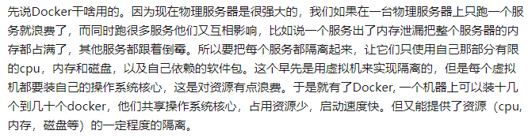

简单来说就是，不同的应用程序所依赖的环境不一样，如果把他们依赖的软件都安装在一个服务器上，不仅需要调试很久，而且可能会有冲突。

如果想把两个应用程序隔离起来，可以在服务器上创建不同的虚拟机，不同的虚拟机放不同的应用，但是虚拟机的开销比较高。docker作为轻量级的虚拟机，是一个很好的工具。

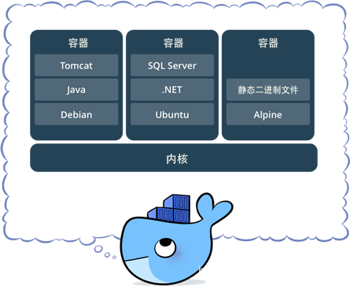

## 作用？

* 解决运行环境不一致所导致的问题。这样就不会产生“本地运行没问题，可一到服务器上就不行了”的情况。
* 限定最大的cpu使用内存硬盘，这样就起到了隔离的作用，避免产生“一块代码产生死循环，把磁盘占满了，其它程序也挂了”的情况。
* 双11时扩展机器用。

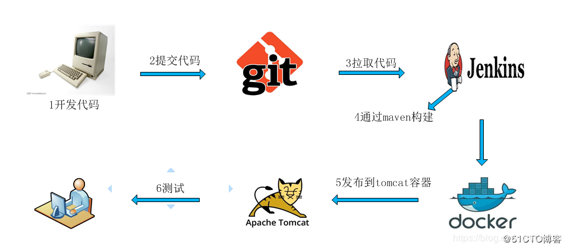


__总结成一句话：docker的标准化让快速扩展，弹性伸缩变得简单__

## 使用之前和之后
之前，可以发现，每发布一个程序，都要走一遍以下的流程：

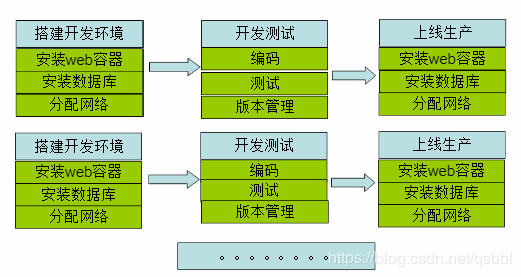

之后：

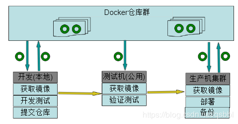

# how？
docker安装？
1、检查计算机是否符合要求，版本和是否开启了虚拟化之类的。
2、去官网下载并安装
3、测试是否安装成功
这是一篇描述在win10上安装docker的博客：
https://blog.csdn.net/hunan961/article/details/79484098

## docker的使用？——hello world
从中央库中拉取镜像

```bash
docker pull hello-world
```
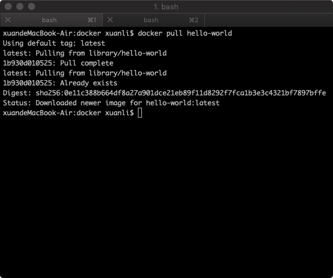

查询到拉取成功

```bash
docker images
```

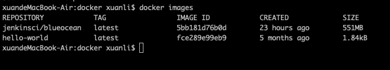

运行镜像，查看到结果

```bash
docker run hello-world
```

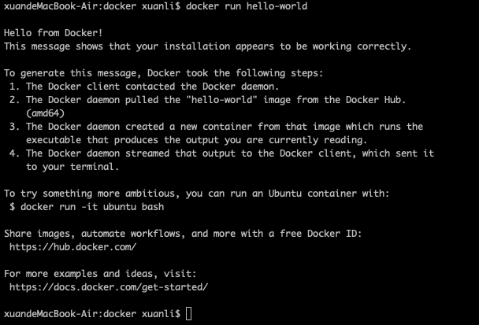

原理解析

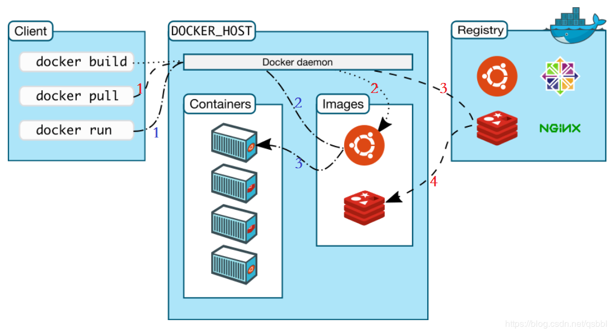

* docker pull的时候，Docker damemon先在本地仓库中找，如果没有，再去中央仓库中拉取，拉取到本地仓库就好了。
* docker run的时候，也是先在本地仓库中找，如果有，直接放到容器里用。否则，去中央仓库中拉取。

__注：本文参考于 https://blog.csdn.net/qsbbl/article/details/86715741__
